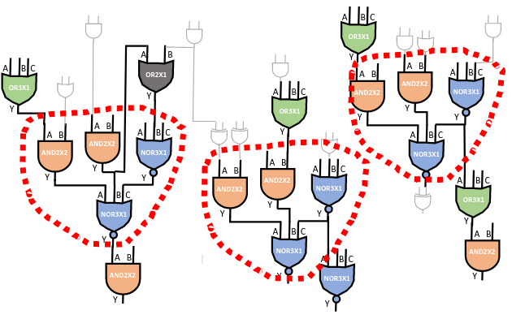
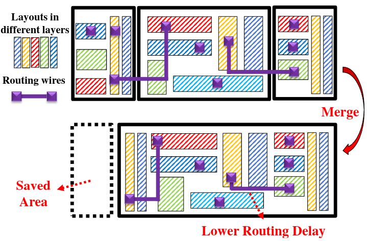
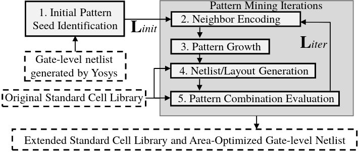
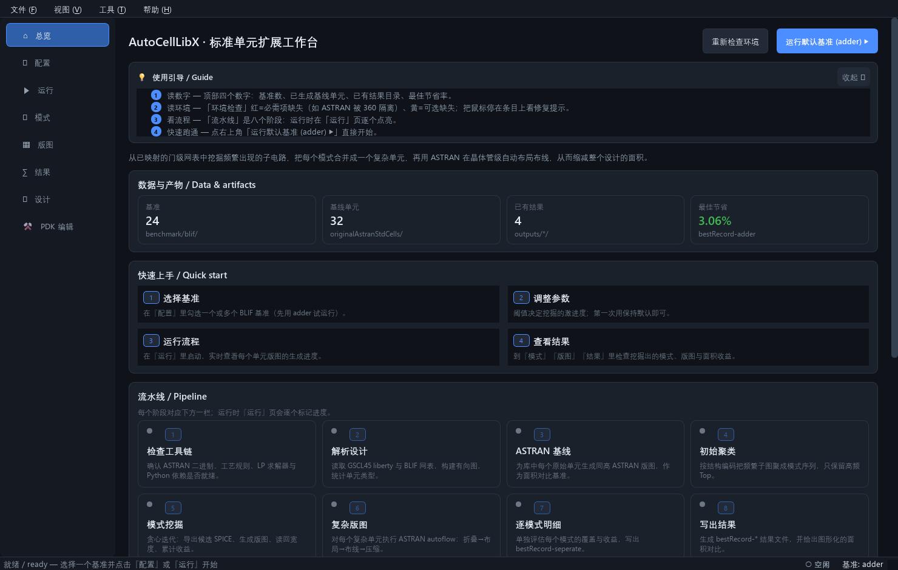
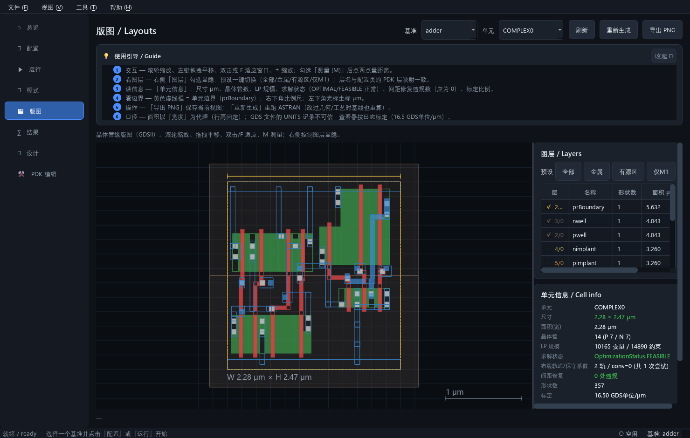
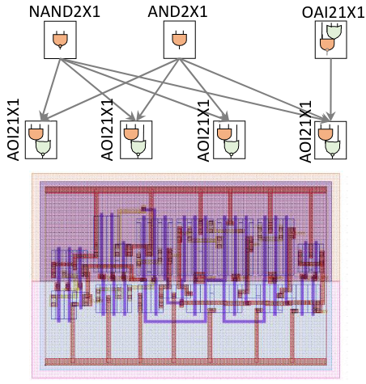
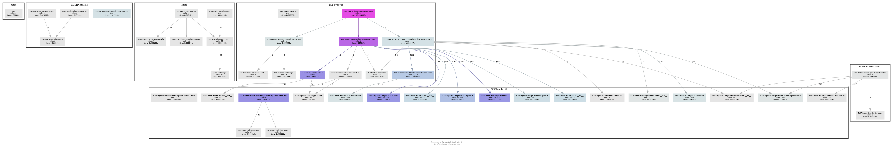

# AutoCellLibX: Automated Standard Cell Library Extension Based on Pattern Mining

## Introduction

Custom standard cell libraries can improve the final quality of the corresponding VLSI designs but properly customizing standard cell libraries 
remains challenging due to the complex characteristics of the VLSI designs. This paper presents an  automatic standard-cell library extension 
framework, AutoCellLibX. It can find a set of standard cell cluster pattern candidates from the post-technology mapping gate-level netlist, 
with the consideration of standard cell characteristics and technology mapping constraints, based on our high-efficiency frequent subgraph 
mining algorithm. Meanwhile, to maximize the area benefit of standard cell customization for the given gate-level netlist, AutoCellLibX 
includes our proposed pattern combination algorithm which can iteratively find a set of gate-level patterns from numerous candidates as 
the extension part of the given initial standard cell library. To the best of our knowledge, AutoCellLibX is the first automated standard 
cell extension framework that closes the optimization loop between the analysis of gate-level netlist and standard cell library customization 
for VLSI design productivity. The experiments with FreePDK45 library and benchmarks from various domains show that AutoCellLibX can generate 
the library extension with up to 5 custom standard cells within 1.1 hours for each of the 31 benchmark designs and the resultant extension of 
the standard cell library can save design area by 4.49% averagely. In this repository, the simple but effective implementation of AutoCellLibX is provided, 
which shows the overall flow that we presented in the released paper for people in the community. We found that this is an interesting problem and we hope we can inspire more innovation. 
If you are curious about more details or some parts of the implementation confuse you, please feel free to raise issue in GitHub or contact us.

<p align="center">
 
</p>

## License

This project is developed by [Reconfiguration Computing Systems Lab](https://eeweiz.home.ece.ust.hk/), Hong Kong University of Science and Technology (HKUST). Tingyuan Liang (tliang@connect.ust.hk), Jingsong Chen, Lei Li, and Wei Zhang (eeweiz@ust.hk) are the major contributors of this project. Users should comply the Apache License attached in the root directory.

Attribution: see [`NOTICE`](NOTICE) for the copyright statement and
[`THIRD_PARTY_NOTICES.md`](THIRD_PARTY_NOTICES.md) for every third-party
component shipped with the project (ASTRAN, GSCL45/FreePDK45 data, benchmark
netlists, bundled Python dependencies).  ASTRAN's own provenance and license
status (vendored from UFRGS; its sources carry no license text, documented
rather than assumed) is in [`tools/astran/LICENSE.md`](tools/astran/LICENSE.md).

## Publications

\[1\] AutoCellLibX: Automated Standard Cell Library Extension Based on Pattern Mining[(Arxiv)](https://arxiv.org/abs/2207.12314)
```
@article{liang2022autocelllibx,
  title={AutoCellLibX: Automated Standard Cell Library Extension Based on Pattern Mining},
  author={Liang, Tingyuan and Chen, Jingsong and Li, Lei and Zhang, Wei},
  journal={arXiv preprint arXiv:2207.12314},
  year={2022}
}
```

## Motivations

Since commonly-used standard cell libraries cannot meet all the requirements in some special scenarios, as an alternative solution, academia and industry take continuous efforts to extend standard cell libraries with custom standard cells for their technology nodes and domain-specific designs. One of the potential sources of these custom standard cells is standard cell merging, which merges several existing standard cells into a new one with an optimized layout, as a simplified example shown in the figure below. It can benefit the design flow from two aspects:

1. It enlarges the back-end solution space of the VLSI design, e.g., placement and routing,  and hence enables some design goals which cannot be achieved based on the original standard cell library, via transistor-level optimizations like diffusion sharing and in-cell signal routing.
2. It shrinks the problem scale of the VLSI back-end tools by reducing the number of gates in the post-technology mapping gate-level netlist and enforcing pre-defined relative position constraints. These factors facilitate the tools to converge at better results.

Standard cell merging provides noticeable optimization potentials but it is critically challenging since numerous factors, e.g., the design context, transistor layout, design rules and expected PPAC metrics, should be considered to realize a beneficial library. First, as for the design context, designers should identify the characteristics of the target design to locate the optimization opportunities and design pattern mining is one of the promising approaches. Second, the transistor network and layout should be designed under the constraints of design rules and PPAC metrics, which is usually called standard cell layout synthesis. In this paper, we propose a fully automatic standard-cell library extension framework, AutoCellLibX which can analyze characteristics of the target gate-level netlist and extent an initial standard cell library with custom complex standard cells to minimize the area cost. 
	
<p align="center">
 
</p>

## Features

1. A practical vertex encoding algorithm, which can find a proper set of neighbor vertex for pattern growth with the consideration of standard cell characteristics, as a part of high-efficiency FSM solution
2. A pattern growth algorithm that can expand the sizes of gate-level patterns while preserving their high recurrence frequencies. Compared to previous FSM approaches, our pattern growth solution carefully handle the overlaps between pattern subgraphs to meet the technology mapping constraint and maximize area reduction
3. A pattern combination algorithm which can iteratively find a set of gate-level patterns from numerous candidates as the extension part of the initial standard cell library to maximize the area reduction of the entire VLSI design
4. To the best of our knowledge, it is the first automated standard cell extension framework that closes the optimization loop between the analysis of gate-level netlist and standard cell library customization. AutoCellLibX can generate SPICE netlists and GDSII layouts of the custom standard cells for downstream VLSI design flow
5. A stage-aware PySide6 desktop GUI that wraps the whole flow with live per-cell progress, an interactive GDS layout viewer, pattern/design graph exploration, in-app PDK editing and area-savings charts
6. It is far from perfect and comprehensively practical and we welcome any comment or suggestion. ^-^


## Implementation Overview

<p align="center">
 
</p>

## Desktop GUI (PySide6)

The repository ships a desktop workbench (`python -m gui`) that wraps the same
flow in a stage-aware, cancellable run and adds the visualisations the command
line never had:

- **Overview / Configure / Run** — environment checks; benchmark and PDK
  selection (built-in or custom BLIF netlists, Liberty/SPICE/technology/LEF/
  layer-map inputs, editable ASTRAN geometry constraints); stage-by-stage
  progress with a live ASTRAN cell panel and a levelled, filterable log.
- **Patterns / Layouts** — the mined complex cells with their pattern graphs
  and transistor-level SPICE, plus an interactive GDS viewer (layer presets,
  ruler, two-click measurement, per-cell LP/solver details, PNG export).
- **Results / Design / PDK editor** — design-level and per-pattern
  area-savings charts with the raw `bestRecord-*` records; an on-demand
  design-graph explorer; and an in-app editor for the ASTRAN technology rules
  (`.rul`) and the Cadence layer map (`.map`) with a Chinese+English
  explanation for every field.

<p align="center">
 
</p>
<p align="center">
 
</p>

See [`gui/README.md`](gui/README.md) for the page-by-page tour and
[`doc/ALGORITHM_DESIGN.md`](doc/ALGORITHM_DESIGN.md) for the algorithm behind it.

## Installation

**Option A — prebuilt Windows installer (no Python needed).** The
[`installer-lfs`](https://github.com/zslwyuan/AutoCellLibX/tree/installer-lfs)
branch hosts a self-contained `AutoCellLibX-Setup.exe` (bundled Python
runtime, ASTRAN, the LP solver and the GSCL45 data; ~1.5 GB installed) via
Git LFS:

```bash
git clone --branch installer-lfs --depth 1 https://github.com/zslwyuan/AutoCellLibX.git
```

then run `AutoCellLibX-Setup.exe`. The delivered handbook
([`tools/package/README_DELIVERY.md`](tools/package/README_DELIVERY.md))
covers installation, the first run and the 360 Total Security
false-positive walkthrough.

**Option B — run from source.**

```bash
pip install -r requirements.txt
pip install PySide6
python -m gui            # desktop GUI (PySide6)
# or the command-line flow:
cd pySrc && python main.py
```

ASTRAN is vendored — build it once with `bash tools/astran/build_astran.sh`
(see [`BUILDING.md`](BUILDING.md)).

## Some Extracted Patterns and Generated Layouts

Some related resultant files are provided in "pySrc/outputs" and below is an example layout.
<p align="center">
 
</p>

## Documentation

| Document | Contents |
|---|---|
| [`doc/ALGORITHM_DESIGN.md`](doc/ALGORITHM_DESIGN.md) | the complete algorithm design (mining, growth, ASTRAN autoflow, interfaces), with figures |
| [`doc/PROJECT_ANALYSIS.md`](doc/PROJECT_ANALYSIS.md) | directory / module / flow analysis |
| [`doc/AUDIT_REPORT.md`](doc/AUDIT_REPORT.md) | algorithm + config audit and the repair record (the engineering log) |
| [`doc/LESSONS_LEARNED.md`](doc/LESSONS_LEARNED.md) | why these defects were hard to see, and the debugging moves that found them |
| [`gui/README.md`](gui/README.md) | the desktop GUI, page by page |
| [`tools/package/README_DELIVERY.md`](tools/package/README_DELIVERY.md) | the delivered installer handbook |
| [`BUILDING.md`](BUILDING.md) | environment, ASTRAN build, run/test commands, installer build |

## Project Hierarchy

Below is a hierarchy tree of this project. For the module-level details,
please refer to the documents above and trace the implementation — the flow
lives in `pySrc/` (see `doc/PROJECT_ANALYSIS.md`), the desktop GUI in
`gui/` (see `gui/README.md`).

```
├── benchmark       // benchmark designs (BLIF netlists + synthesis scripts)
├── doc             // documentation: algorithm design, analysis, audit reports, figures
├── gui             // PySide6 desktop GUI (Qt-free core + widgets + tabs)
├── pySrc           // AutoCellLibX Python flow (pattern mining, growth, layout flow)
├── stdCelllib      // FreePDK45 (GSCL45) PDK and standard cell libraries
├── tests           // pytest test suite (unit + integration)
├── tools           // vendored ASTRAN sources + gurobi_cl-compatible LP solver
│   └── package     // self-contained Windows installer toolchain
└── dist            // installer build output (hosted on the installer-lfs branch)
```

The repository is **self-contained**: ASTRAN is vendored under `tools/astran/`
and the LP-solver wrapper under `tools/gurobi_cl/`. See
[BUILDING.md](BUILDING.md) for building ASTRAN, running the flow and the test
suite, and [doc/PROJECT_ANALYSIS.md](doc/PROJECT_ANALYSIS.md) /
[doc/AUDIT_REPORT.md](doc/AUDIT_REPORT.md) for the technical analysis.

Below is the call graph of the project for your reference:

<p align="center">
 
</p>

## Dependencies

Python packages (see `requirements.txt`): numpy, networkx, matplotlib,
gdstk, blifparser, liberty-parser, lark, mip (python-mip + COIN-OR CBC),
tqdm, easydict, pytest — plus **PySide6** for the desktop GUI.

```
pip install -r requirements.txt
```

The C++ layout synthesizer [ASTRAN](https://github.com/aziesemer/astran) is
**vendored** under `tools/astran/` and built in-tree with MSYS2/MinGW64
(`bash tools/astran/build_astran.sh`, see [BUILDING.md](BUILDING.md)) — no
external installation or path configuration is needed.

## Todo List

1. support for ASAP7 PDK
2. logic level optimization of subgraph
3. reproduce the layout optimization in related works

## Issue Report

This project is under active development and far from perfect. We do want to make the placer useful for people in the community. Therefore,
* If you have any question/problem, please feel free to create an issue in the [GitHub Issue](https://github.com/zslwyuan/AutoCellLibX/issues) or email us (Tingyuan LIANG, tliang AT connect DOT ust DOT hk)
* We sincerely welcome code contribution to this project or suggestion in any approach!


(last updated Oct 8, 2026)
