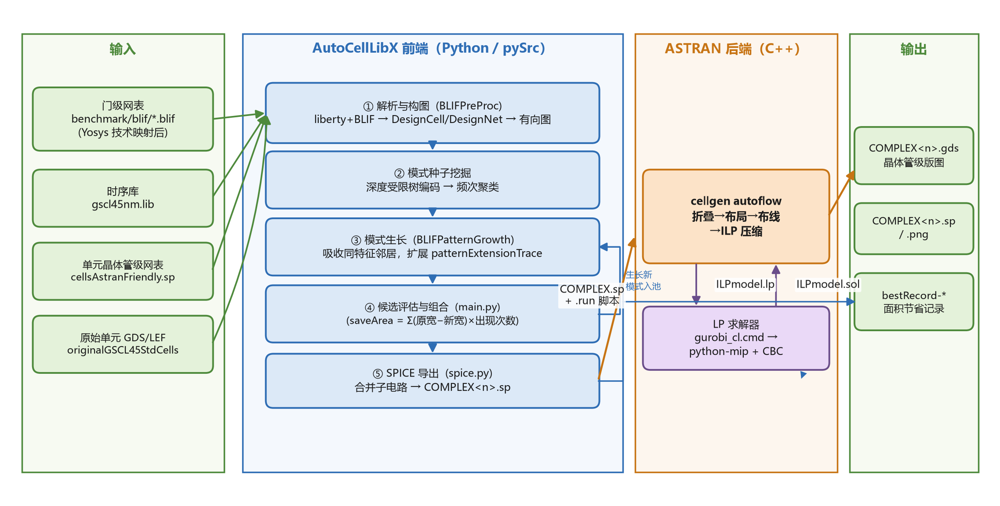

# AutoCellLibX 自底向上实现指南

> **写给谁**：大四本科生——学过数字逻辑（知道与非门、触发器）、会 Python、
> 第一次接触标准单元库 / EDA 流程。
> **读完你能**：从零讲清楚"一个 BLIF 网表是怎么一步步变成几个新标准单元的
> GDS 版图的"，并且敢于上手改这份代码。
> **怎么读**：共 9 层，自下而上。每层回答四个问题：*它解决什么问题 → 数据长
> 什么样 → 代码在哪里 → 这里踩过什么坑*。先读 §0 十分钟全景，再顺序往下。
>
> 配套文档：[ALGORITHM_DESIGN.md](ALGORITHM_DESIGN.md)（算法的数学细节）、
> [PROJECT_ANALYSIS.md](PROJECT_ANALYSIS.md)（目录与模块全览）、
> [LAYER7_ASTRAN.md](LAYER7_ASTRAN.md)（第 7 层 ASTRAN 原理深潜）、
> [LAYER_VERIFICATION.md](LAYER_VERIFICATION.md)（九层实现逐条校验报告）、
> [RESEARCH_AND_OPTIMIZATION.md](RESEARCH_AND_OPTIMIZATION.md)（2023–2026 文献
> 综述与优化路线图）、
> [AUDIT_REPORT.md](AUDIT_REPORT.md)（缺陷档案与修复记录）、
> [AGENTS.md](../AGENTS.md)（给改代码的人的不变量清单）。

---

## 0. 十分钟全景：这个系统在干什么

**一句话**：在一个已经完成技术映射的门级网表里，找出**反复出现、结构相同**
的小电路组合（比如"两个与非门 + 一个或门"总是一起出现），把每一组**合并成
一个新的更大的标准单元**，并自动生成它的晶体管级版图——因为合并后的单元
共享扩散区、省掉了单元之间的互连，整个设计会更省面积。



系统由三个角色组成，**只靠文件说话**（没有函数调用、没有共享内存）：

| 角色 | 语言 | 输入文件 | 输出文件 |
|---|---|---|---|
| 前端（模式挖掘） | Python | BLIF 网表、Liberty/SPICE 库 | `COMPLEX<n>.sp` 网表、`.run` 脚本 |
| 后端（版图综合）ASTRAN | C++ | `.sp`、`.rul` 工艺规则 | `COMPLEX<n>.gds` 版图、`.Astranlog` 日志 |
| LP 求解器（压缩用） | Python + CBC | `ILPmodel.lp` | `ILPmodel.sol` |

前端读回 `.Astranlog` 里的版图宽度来计算"合并到底省了多少面积"。

**贯穿案例**：基准电路 `adder`（一个 32 位加法器，几百个门）里，
`NAND2X1 + NAND2X1 + OR2X1` 这个组合出现了几十次。系统把它合并成新单元
`COMPLEX0`。接下来九层，就沿着这个案例从文件一路走到 GDS。

**术语表**（遇到不认识的词先回这里）：

| 术语 | 意思 |
|---|---|
| 技术映射 (technology mapping) | 把与/或逻辑表达式翻译成"用哪些标准单元实现"的步骤，由 Yosys 等综合器完成，**不在本系统范围内** |
| BLIF | 一种文本格式的门级网表，每个门一行 |
| Liberty (.lib) | 标准单元库的"数据手册"：每个单元有哪些引脚、哪些是输入哪些是输出 |
| 标准单元 (std cell) | 库里预先设计好的小电路（NAND2X1 = 两输入与非门），等高不等宽，一行行拼起来用 |
| 复杂单元 (COMPLEX cell) | 本系统新造的单元：把几个标准单元合并成一个 |
| GDSII | 芯片版图的工业标准文件格式：一层一层的多边形 |
| 行高 (row height) | 标准单元的高度，同一库里固定（GSCL45 是 2.47 µm），所以**面积 ∝ 宽度** |
| DRC | 设计规则检查：多边形之间的间距/宽度必须满足工艺要求 |
| ILP | 整数线性规划：把"让版图更窄"写成一堆约束 + 一个目标函数去求解 |
| 模式 (pattern) | 反复出现的子电路结构，用一串**编码字符串**唯一标识 |

---

## 第 1 层 · 数据格式：一切从认识文件开始

**为什么自下而上从文件开始**：三个角色靠文件解耦，所以文件格式就是系统的
"物理层"。这层的代码在 `pySrc/` 里都很薄，但每一个字段都有用途。

### 1.1 BLIF——门级网表

打开 `benchmark/blif/adder.blif`，你会看到两类行：

```
.subckt NAND2X1 A=g_12 B=g_13 Y=g_27      # 一个门实例：类型 + 引脚到信号的映射
.names g_27 g_31                           # 一个真值表门（还没映射成库单元的部分）
```

`.subckt` 行就是"这里放了一个 NAND2X1，它的输入 A 接信号 g_12……"。
`.names` 是真值表形式的功能门，前端会把它当成类型为 `bool-...` 的虚拟单元。
（上例是示意；adder.blif 里实际只有 3 条 `.names`，是 `$false/$true/$undef`
常量门。）
**注意**：BLIF 里只有"连接关系"，没有晶体管、没有版图。

### 1.2 Liberty（.lib）——单元的引脚字典

`stdCelllib/gscl45nm.lib` 里每个单元声明自己的引脚方向：

```
cell (NAND2X1) {
    pin (A)  { direction : input; }
    pin (B)  { direction : input; }
    pin (Y)  { direction : output; }
}
```

前端只需要它做一件事：**知道每个引脚是输入还是输出**（这决定了图里边的方向）。

### 1.3 SPICE——晶体管级实现

`stdCelllib/cellsAstranFriendly.sp` 里每个单元是若干晶体管：

```
.subckt NAND2X1 VCC Y GND A B
M0 Y A VCC VCC PMOS W=0.5u L=0.05u
M1 Y B VCC VCC PMOS W=0.5u L=0.05u
M2 Y A net_1 GND NMOS W=0.5u L=0.05u
...
```

这是"合并"这个动作真正操作的对象——合并单元 = 把几个这样的子电路**拼接并
重新连线**（第 5 层）。

### 1.4 LEF——单元的版图摘要

`stdCelllib/gscl45nm.lef` 每个单元一行尺寸：`SIZE 0.76 BY 2.47`（NAND2X1）。
面积对比只从这里拿"标称宽度"（第 6 层）。

### 1.5 GDSII——版图几何

最终产物。二进制格式，本仓库用 `gdstk` 库读取：一个 GDS 由多层多边形组成，
每层有**层号**（GSCL45 约定：active=1、poly=9、contact=10、metal1=49……）。

### 1.6 工艺规则（.rul）与层映射（.map）

- `tools/astran/build/Work/tech_freePDK45.rul`：ASTRAN 的设计规则，一行一条，
  如 `S1P1P1 0.075`（poly 与 poly 的最小间距 0.075 µm——S=间距/E=包含/W=宽度）。
- `stdCelllib/gds2_encounter.map`：层名 ↔ GDSII 层号的对照，如
  `metal1 NET 49 0`。

**这层的坑**：GDS 文件里自带的 UNITS 记录是不可信的（ASTRAN 写错了），
所以 GUI 的版图查看器不用它，而是用日志里的 `Cell Size` 行来标定比例——
记住这个例子：**文件里写的不一定对，交叉验证才是常态**（详见 `gui/gds_model.py`
的注释）。

---

## 第 2 层 · 解析与数据结构：把文件变成对象

**代码入口**：`BLIFPreProc.genGraphFromLibertyAndBLIF`
（配合 `BLIFGraphUtil.py` 里的三个类）。

解析分三步：

1. **读 Liberty** → 每种单元类型一个 `StdCellType`（记住引脚方向）；
2. **读 BLIF** → 每个门实例一个 `DesignCell`（记住它的类型和每根引脚接到哪
   条信号），每条信号一个 `DesignNet`（记住谁驱动它、谁用它）；
3. **建图** → networkx 有向图 `BLIFGraph`：**节点 = 单元实例，边 = 信号流向**
   （驱动单元 → 负载单元）。

跑一下就能看到真实规模：

```python
# 在 pySrc 目录下
from BLIFPreProc import genGraphFromLibertyAndBLIF
g, cells, netlist, types = genGraphFromLibertyAndBLIF(
    "../stdCelllib/gscl45nm.lib", "../benchmark/blif/adder.blif")
print(g.number_of_nodes(), g.number_of_edges())   # 710 803
```

**两个设计决策要理解**：

- `bypassTypes = ["DFF", "bool"]`（`globalVariables.py`）：时序单元（触发器）
  和未映射的 bool 门**不参与**合并——前者打破组合逻辑的边界，后者没有库里
  对应的 SPICE 实现。
- 图的节点是**实例**不是类型：同一类型的 NAND2X1 有 192 个实例，就是 192 个
  节点。模式挖掘找的是"哪些**实例组合**反复出现"。

---

## 第 3 层 · 编码：把"找重复子电路"变成"字符串分组"

**问题**：找出网表里反复出现的子电路，学术上叫频繁子图挖掘（FSM），核心
难点是判断"两个子电路是否同构"——通用解法是 NP-hard 的图同构判定。

**这层的关键想法**（`BLIFPreProc.extractAndEncodeSubgraph_Tree`）：
以某个单元为根，沿输入方向做深度为 1 的 BFS，把沿途单元的**类型名按顺序拼成
一个字符串**。以上面 NAND2X1(NAND2X1, NAND2X1) → OR2X1 的结构为例，编码就是：

```
[NAND2X1,NAND2X1,OR2X1]
```

**编码相同 ⇒ 结构等价**（在这个粒度下）。于是"找同构子图"退化成"按字符串
分组"——线性时间。

**两个已知边界**（校验发现，详见 [LAYER_VERIFICATION.md](LAYER_VERIFICATION.md)
§L3）：编码只拼类型名，不区分引脚排列/跨边扇出，所以"等价"是启发式而非证明；
且子节点**按网线枚举顺序拼接、不做排序**——根节点的几个输入类型不同时，
同构实例可能得到不同编码而被拆成两类（频次被低估）。adder 现有结果靠网表
生成顺序一致而幸免；这是挖掘层最值得修的缺陷（优化路线图 P0-1）。

**为什么这个粒度是够的**：标准单元类型本身就是对内部电路的抽象
（"NAND2X1"已经代表了一个固定的 4 管结构），所以"类型组成的树相同"就足以
保证"晶体管级结构相同"。这是整个系统最漂亮的一步：**利用领域知识（单元库）
把指数问题降成线性问题**。

---

## 第 4 层 · 聚类与生长：从种子到更大的模式

**代码入口**：`BLIFPreProc.heuristicLabelSomeNodesAndGetInitialClusters` 与
`BLIFPatternGrowth.growASeqOfClusters`。

- **初始聚类**：把所有实例按编码分组，每组叫一个 `DesignPatternCluster`，
  同编码的所有簇构成一个 `DesignPatternClusterSeq`（一个"模式"）。按
  **簇数 × 簇大小** 排序——既大又频繁的模式优先考察。
- **生长**：对当前模式的**所有实例**，统计它们边界上的邻居。邻居的"特征码"
  由类型名 + 连接位置组成（如 `XNOR2X1_c0o0` 表示"接在 0 号单元输出上的
  XNOR2X1"）。**一次只吸收出现次数最多的那一类邻居**。

为什么"一次只吸收一类"？因为同一模式的所有实例必须**同时**长成同样的形状
——按特征码分组保证了吸收后仍然同构，且不会和别的模式重叠（满足技术映射
约束：一个实例只能属于一个单元）。

于是模式会沿一条演化链长大（adder 的真实链条）：

```
[NAND2X1,NAND2X1,OR2X1]
  → [NAND2X1,NAND2X1,OR2X1]+XNOR2X1_c0o0          (COMPLEX9 的形状)
  → …+OAI21X1_c2o0                                 (COMPLEX10 的形状)
```

这串 trace 就是模式的**唯一身份**：`patternExtensionTrace`。全系统对"见过
没有"的判断都比较 trace，不比较整数 id（id 每次运行临时分配——比较 id 是
一个真实发生过的 bug，见 `AGENTS.md` 不变量 5）。

**两个指南原本没说的真相**（校验发现）：
1. 生长过去**不知道面积**，停止靠事后回看——链条末端 COMPLEX10 实际是负收益
   （`bestRecord-seperateadder`：−56.05）。现已加入**预估剪枝**（P0-3，
   `pySrc/benefit.py`）：用运行内在线标定的"尺寸→收缩率"模型，在送 ASTRAN
   之前就否决预测为负收益的分支；生长也从"每轮只长 top-1"放宽为**束搜索**
   （每轮长前 2 个队首，`growBeamWidth`）。
2. "一个实例只属于一个单元"的 enforcement 是**破坏式**的：想吸收的邻居已被
   别的模式占用时，直接把对方的簇整个 `disabled=True` 踢掉，没有收益比较
   （`BLIFPatternGrowth.py:118-120`）。

---

## 第 5 层 · 导出 SPICE：把三个单元"焊"成一个

**代码入口**：`spice.exportSpiceNetlist`（约 80 行，值得通读）。

把一个模式的**一个实例**（3 个 `DesignCell`）变成一个 `.subckt`，分四步：

1. **前缀隔离**：第 k 个单元的所有信号和晶体管改名加 `cl<k>#` 前缀，
   避免 3 份 NAND2X1 的内部信号互相撞名；
2. **内部重连**：若单元 A 的输入来自组内单元 B 的输出，把 A 的引脚网络名
   替换成 B 的输出名——这就是"焊接"；
3. **端口内化**：输出若只驱动组内负载，就从对外端口中删掉（它变成了内部
   信号，这正是省面积的一部分来源）；
4. **确定性写盘**：端口列表用**插入有序 dict** 汇总——用普通 `set` 的话，
   PYTHONHASHSEED 会让每次运行导出不同的网表，布局缓存随之全部失效
   （`tests/unit/test_determinism.py` 钉死了这一点）。

产物长这样（`outputs/adder/COMPLEX1.sp` 的真实头部）：

```
.subckt COMPLEX1 cl2#Y GND VCC cl1#B cl1#A cl2#A cl2#B cl2#C
Mcl0#0 VCC cl1#Y cl0#a_2_6# VCC PMOS W=1u L=0.05u
...
* pattern code: [XNOR2X1,XOR2X1,OAI21X1]
* 54 occurrences in design
```

**这层的坑**：`.subckt` 的**端口顺序**会改变 ASTRAN 的布局结果（不只是格式
问题）——实测有单元变得更好、有单元变得更差，所以保持插入序、任何重排都要
逐单元实测（`AGENTS.md` 记录了 2.4→2.0 与 3.6→8.4 两个方向的案例）。

---

## 第 6 层 · 面积度量：为什么用"宽度"当面积

合并是否值得，需要一个可信的面积口径。这层只有两个事实，但都是**不变量**：

1. **同一库里所有单元等高**，所以面积 ∝ 宽度。三个面积来源统一读宽度：
   库单元读 LEF 的 `SIZE`，生成的单元读 `.Astranlog` 的
   `-> Cell Size (W x H): 5.13 x 2.47` 行。
2. **比较必须同高**。历史上基线在 3.2 µm 行高、产物在 2.47 µm 行高时直接
   比宽度，把一个候选从 +6.5% 翻成 −19.5%（`AGENTS.md` 不变量 1/10）。
   现在基线与产物都由同一个 `runAstranForNetlist`、同一套几何常量生成。

**另一个坑**：ASTRAN 求解失败时会写全零解、产出 **0×0 版图**且"看起来成
功"——宽度 ≤ 0 的模式必须从收益统计中剔除，否则会报告假节省。

**宽度之外的第二、第三指标**（2026-10 新增）：宽度仍是最优准则，但每个
候选现在还会报告——①**可布性**（`pySrc/routability.py` 从 .Astranlog 解析
路由器自己的 `Rt. Density` 拥塞值与 Pathfinder 拆线轮数；窄但布不通的单元
会在详细布线阶段把收益吐回去）；②**电气量**（`pySrc/electrical.py`：漏电
和、输入电容、延迟代理、以及**内化网数**——合并把组内互连从外部世界抹掉，
这是宽度永远看不见的动态功耗节省）。两者默认只报告、可配置成硬门限。

---

## 第 7 层 · ASTRAN：把晶体管网表变成版图

> 本节给出原理级展开；逐行源码地图（每个阶段的入口函数、代价函数、踩坑位置）
> 见配套文档 **[LAYER7_ASTRAN.md](LAYER7_ASTRAN.md)**。

**输入**：一个 `.sp`（如 COMPLEX1.sp）+ `.rul` 规则 + `.run` 脚本（几何参数）；
**输出**：`.gds` + `.Astranlog`。调用方式是 `Astran --shell xxx.run`，
`.run` 是一个命令脚本（`outputs/adder/COMPLEX1.run` 的真实内容）：

```
set lpsolve "D:\...\gurobi_cl.cmd"     # 压缩阶段调用的 LP 求解器
load technology "D:\...\tech_freePDK45.rul"
load netlist "D:\...\COMPLEX1.sp"
set rowheight 13                        # 行高 = 13 × 0.19 = 2.47 µm（GSCL45 同高）
set grid 0.19 0.19                      # 布线网格 = 库的 M1 节距
set supplysize 0.26                     # 电源轨总宽（上下各 0.13，与库 abutment 轨一致）
set nwellpos 1.235                      # N 阱下沿 = H/2 → P/N 扩散区等高
set celltemplate "Tapless"              # 单元内不放衬底接触（省宽度）
cellgen select COMPLEX1
cellgen autoflow                        # 下面五个阶段全自动（含失败重试）
export layout COMPLEX1 ./outputs/adder/COMPLEX1.gds
```

每条 `set` 都在回答"这个单元长什么样"：行高固定 ⇒ 面积 ∝ 宽度（第 6 层的
根基）；`nwellpos` 取行高一半 ⇒ P 管区和 N 管区可用高度相等（历史上取过
1.0825，两侧不等高、小的一侧成为宽度瓶颈，见 AUDIT_REPORT）。

`autoflow` 内部的阶段链条（源码：`tools/astran/src/autocell2.cpp:140-169`），
每个阶段在回答一个版图问题：

| 阶段 | 问题 | 方法（与关键细节） |
|---|---|---|
| ① select（独立命令） | 网表里有什么管子？ | 递归展平层次化子电路：内部网加实例后缀防撞名、端口按实例顺序重命名——**这就是端口顺序影响版图的通道** |
| ② calcArea | 几何框架怎么摆？ | 由 rowheight/grid/supplysize/nwellpos 推出布线轨道位置和 P/N 可用扩散高度 `nSize/pSize`；`posNWell` 是 **N 阱下沿**而非中线 |
| ③ fold | 管子太宽放不下？ | 行高钉死了单管最大宽度；孤立宽管拆 `ceil(W/size)` 条并联腿，串联链**整链同腿数**折叠保持对称 |
| ④ place | P/N 两排管子怎么排序？ | **Threshold Accept**（模拟退火的确定性变体，无 srand → 结果可复现）：代价 = 栅错位 + 扩散间断数 + 总宽 + 线长估计 + 拥塞；P/N 不等长补 GAP |
| ⑤ route | 内部连线怎么走？ | **Pathfinder 协商布线**：允许拥塞地布，冲突节点历史代价递增把网"挤开"，迭代拆线重布直到无冲突（上限 8000 轮） |
| ⑥ compact | 版图还能多窄？ | **ILP**：坐标是变量、间距规则是约束、宽度最小化（目标里 width 权重 5000 绝对主导） |
| ⑦ export（独立命令） | 交付什么？ | 写 GDS（层号查 .rul 映射）+ 日志打印 `Cell Size`；0×0 盒被跳过——所以求解失败导出的是**空单元** |

外层还有两圈容错循环（`autocell2.cpp:140-169`）：内圈从 2 条轨道起逐步加轨
直到预估拥塞可接受；外圈在 compact 失败时 `conservative++`——收缩扩散区给
布线让路，最多 4 次，仍失败则整个单元报错、前端剔除该模式。

ILP 压缩的直观理解：把每个图形的左右上下坐标当成变量，把"相邻图形间距 ≥
规则值"写成约束（大约 2–6 万个变量/约束），让 CBC 求解器把总宽度压到最小。
成对图形的位置关系是**三选一析取**（B 在 A 右边 / 上边 / 对角右上），用
`b1+b2+b3=1` 和大 M=20000 实现"选中才生效"。求解 300 秒封顶（找得到可行解
就收），因为压缩只影响"多窄"，不影响合法性。

**耗时与失败模式**（排障时第一眼看日志）：

- 一个单元 5–10 分钟，大头是布局迭代 + Pathfinder 布线 + ILP；
- 日志出现 `Cell Size (W x H): 0 x 0` ⇒ 求解失败，该模式被剔除；
- `INFEASIBLE`（被证明不可行，不是超时）⇒ 适配层去掉过紧的第三类对角间距
  析取重建模型重试，ASTRAN 的修复 pass 随后强制真实间距
  （`AGENTS.md` 的"option-3 重试"条目；现行 2.47 µm 等井高几何下 adder 的
  四个单元均未触发，它是安全网而非常态）。

---

## 第 8 层 · 集成：把各层粘成一条可靠的流水线

**代码入口**：`pySrc/main.py` 的 `main()`（约 390 行，是全系统的"总装车间"）。

主循环是**贪心**的：每轮把当前最优的几个候选送去生成版图、算总节省；超过
历史最佳就记入 `bestRecord-<bench>`，否则停止（收益递减即收手）；同时把
队首模式生长一圈放回候选池。伪代码（P0 优化后的现状）：

```
候选池 = 初始模式(Top-30)
循环最多 topThr(=5) 轮:
    对前 topThr 个候选: 去重(按trace) → 导出.sp → ASTRAN版图 → 读宽度
        → 报告可布性/电气量指标(P0-4/P1-7)
        → 按"簇不重叠"去重累计节省(P0-2)
    if 本轮节省 > 历史最佳: 写 bestRecord
    else: 停
    束生长(P0-3): 取前 growBeamWidth(=2) 个队首, 逐分支预估收益、
        剪掉预测为负的, 生长后放回候选池
```

**集成层的四个工程决定**（都能在代码里找到对应实现）：

1. **文件契约**：前后端只交换文件（.sp/.run/.gds/.Astranlog），所以任何一端
   可以独立替换/重跑；
2. **缓存**：`.gds` 比 `.sp` 旧才重新生成（mtime 判断）——挖掘重跑几遍也不
   会重算版图；
3. **失败隔离**：一个单元生成失败只剔除该模式，不毁整个基准（try/except +
   0×0 检查）；
4. **确定性**：任何进入产物的遍历顺序都必须固定（第 5 层的有序 dict 就是
   这条在 `spice.py` 的落地）。

---

## 第 9 层 · GUI：把流水线变成可操作的仪器

**代码入口**：`gui/`（`python -m gui` 启动，页面导览见
[gui/README.md](../gui/README.md)）。

GUI 不是重写流程，而是**分层复用**：

```
gui/paths.py artifacts.py gds_model.py flow_core.py   ← Qt-free 核心（可单测）
gui/widgets/…                                          ← 画布/图表/日志
gui/tabs/…                                             ← 8 个页面
```

- `flow_core.py` 是 `main.py` 控制流的**忠实移植** + 进度回调 + 取消——
  保证 GUI 跑出来的结果和命令行一致；
- `gds_model.py` 把 GDS 读成多边形并按日志标定到 µm（第 1 层的 UNITS 坑）；
- `artifacts.py` 解析 `bestRecord-*`/`.Astranlog`/`.sp`（第 8 层的契约）。

为什么要分"Qt-free 核心 + Qt 外壳"？因为核心可以被 pytest 覆盖
（`tests/unit/test_gui_artifacts.py`，194 个测试），而界面代码不需要（也无法）
在无显示环境下测试。**这也是自下而上思想的最后一次应用：可测试性来自分层。**

---

## 上手路线：六个动手练习（自下而上）

| # | 练习 | 验收标准 |
|---|---|---|
| 1 | 仓库根目录 `python -m pytest` | 194 passed；顺便读一遍 `tests/unit/` 的测试名 |
| 2 | 写 5 行代码调用 `genGraphFromLibertyAndBLIF` 打印 adder 的节点/边数 | 710 / 803 |
| 3 | 手算编码：挑一个 OR2X1 实例，沿输入走一层，写出编码串 | 与 `heuristicLabel…` 打印的 top 模式对得上 |
| 4 | 把 `main.py` 的 `topThr` 改成 1 跑一遍（输出目录先备份） | 理解 `bestRecord-adder` 的每一行是怎么来的 |
| 5 | `python -m gui` → 版图页打开 COMPLEX9 | 能数出 P/N 管数、说出宽度从哪一行读出来 |
| 6 | 读 `spice.exportSpiceNetlist`（80 行） | 能向别人解释 `cl<k>#` 前缀和"端口内化" |

## 常见坑速查表

| 症状 | 根因 | 详读 |
|---|---|---|
| 版图宽度为 0 / 模式莫名消失 | LP 求解失败写全零解 | AGENTS.md"失败的求解是静默的"；AUDIT_REPORT §5.5 |
| 面积收益数字离谱（正负翻转） | 两侧行高不一致 | AGENTS.md 不变量 1/10 |
| 重跑结果每次都不同 / 缓存全失效 | 遍历顺序进了产物 | AGENTS.md 不变量 9；test_determinism.py |
| GUI 报"无法启动 ASTRAN 二进制" | 360 误报隔离了 Astran.exe | gui/README.md；README_DELIVERY.md |
| 同名 COMPLEX9 与旧文件对不上 | id 是临时分配的 | AGENTS.md 不变量 6 |
| CBC 报 NO_SOLUTION_FOUND 后全是零 | 适配层把 FEASIBLE 误判为失败 | AGENTS.md 不变量 4 |

---

*本文与代码同步维护：引用的函数名都能在 `pySrc/`、`gui/` 里直接搜索到。
数据规模与宽度等数字以仓库当前 `outputs/` 为准（工具链更新会重生成）。*
